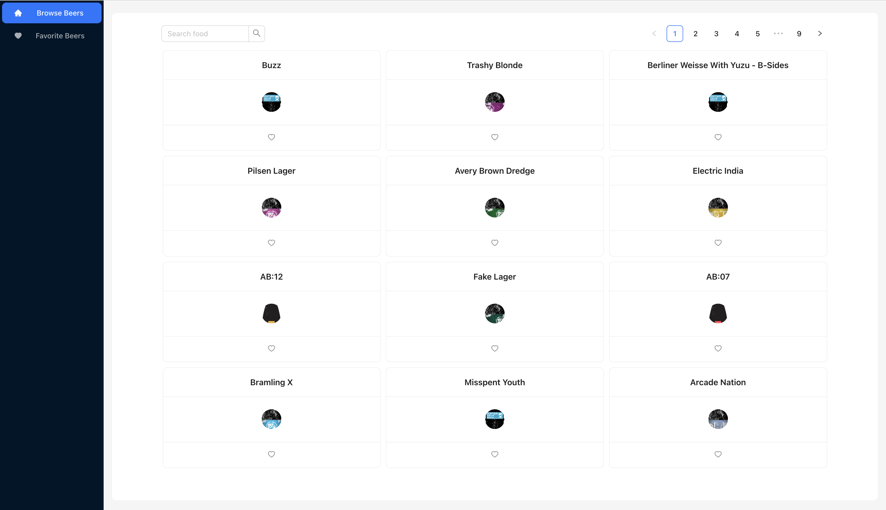
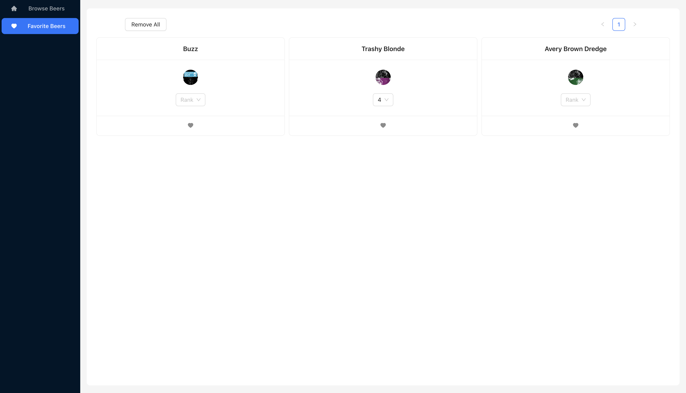
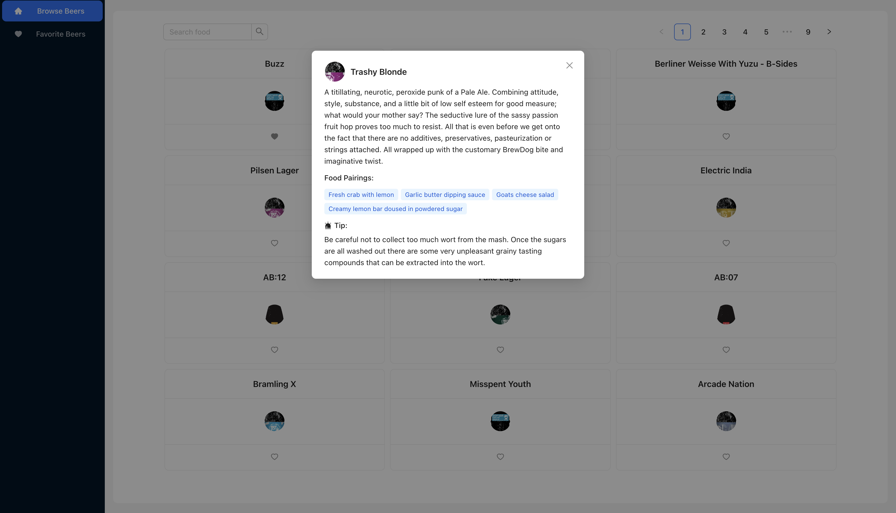

# Frontend Beer Brewer app

A React application that presents a beer selection.

- The user can click on a card to see more information about a beer.
- The user can set a beer as favorite, and view all his favorite beers in a different page.
- The user can filter beers by food pairing using a free text field.
- In Favorite Beers page, the user can click the "Remove All" button to remove all his favorite beers.
- In Favorite Beers page, the user can rank the beer (values from 1 to 5).
- State management is Redux Toolkit, styling with Ant design and styled-components.

# Local run

You can view the app live on:
 
To run locally:

1. `npm install` `npm start`
2. View the project locally at http://localhost:5173/

